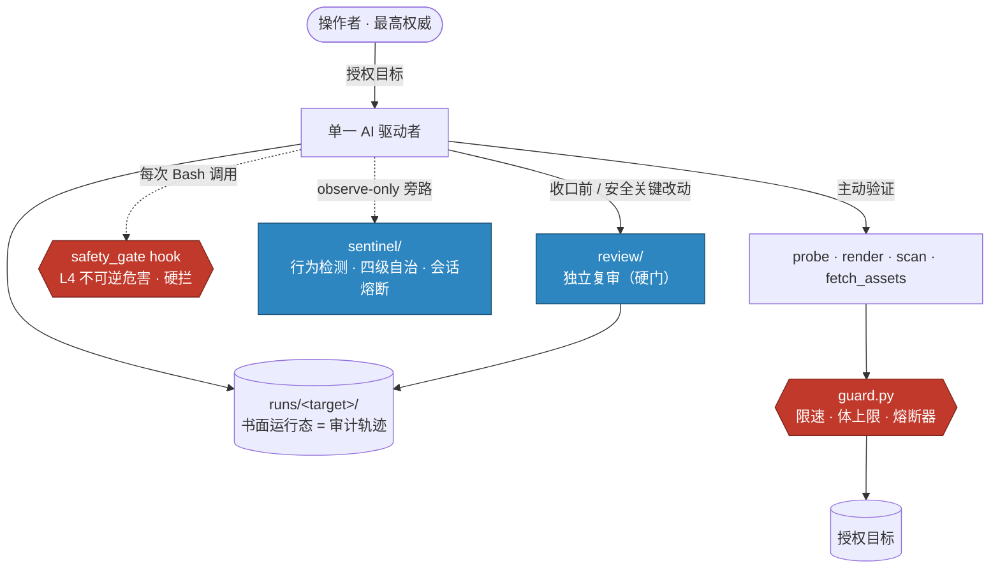

<div align="center">

# 寻迹 · Xunji

**面向 Claude Code / Codex 的自主红队工作区 —— 专注 Web 打点（initial access）**

[](https://www.python.org/)
[](#-安装)
[](https://claude.com/claude-code)
[](#%EF%B8%8F-安全模型)

**中文** ｜ [English](README.en.md)

</div>

---

**这是一件红队武器。** 一个由单一 AI 自主驱动、专攻 Web 打点（initial access）的漏洞发现与**完整武器化利用**工作区，同时让整个过程 **可审计、证据绑定、被一条机器强制的硬底线兜住**。

> 它给 AI 的是 **判断纪律 · 接地识别知识 · 运行态结构 · 一条按效果划定的硬底线** —— 而**不是**扫描器、开箱通杀套件、或 JSON 编排器。
> 驱动者亲手编写的武器化利用**自由（方法无上限）**；唯一被硬拦的是**对目标自动执行的、不可逆 / 以伤害为目的的效果**。
> **「不是通杀套件」≠「不是武器」**：项目本身就是武器，被排除的只是"不分目标的机械批量通杀"。

## 🧭 架构总览



三条防线各司其职：**`safety_gate` hook** 按效果硬拦不可逆危害（执法者）；**`guard.py`** 在工具层限速、限量、熔断（保护目标也保护你自己的可达性）；**`sentinel/`** 只观察不拦截，给每个动作归因贴级、聚合失控时刹车。

## 🔁 运行循环

```text
单一 AI 驱动者
  → 维护书面运行态
  → 自主选择下一个探索前沿
  → 用证据验证
  → 复审浅层工作与假阳性
  → 只报告证据支持的结论
```

只要还有安全的开放前沿，AI 就**不应**等用户指定下一个漏洞类别。它自己选定前沿、记录理由、持续推进，直到该前沿被**确认 / 否决 / 因阻碍搁置（deferred） / 以 Type B 推理收口（closed）**。

## 🧠 设计思路

整个项目建立在**一个决断**和**三根支柱**之上。

### 核心轴：管「效果」，不管「方法」

被约束的，永远是**一个动作对活靶造成的不可逆效果、以及由谁按下执行键** —— 绝不是技术本身。构造并编写武器化利用（RCE 链、鉴权绕过、反序列化 gadget、上传拿 shell、提权、C2 / 反弹 shell / webshell）是**方法，方法自由**，0day 发现就在这里。唯一的硬线是**对目标自动执行的、不可逆 / 以伤害为目的的效果**（销毁、拖库、DoS、资金移动）—— 而这条线按**效果**、在**代码里**、于**运行时**划定，绝不靠文件名或被禁关键词。

> 一条让 AI 畏手畏脚的软约束（「别写那个 exploit」「别提那个工具名」）是**本末倒置** —— 它阉割了操作者真正需要的能力，对安全却毫无贡献。**安全是 hook 的活，按效果管；能力是驱动者的活，没有方法上限。**

### 三根支柱，刻意**不做** playbook

| 支柱 | 内容 | 位置 |
|---|---|---|
| **判断纪律** | 如何选前沿、掂量证据、抵抗假阳性、不过早收手 | `docs/cognition/` · `docs/WORKFLOW.md` |
| **接地知识** | 真实产品的识别签名与弱点锚点，作为**变体分析输入**，绝不作开箱 payload | `knowledge/` |
| **机器硬底线** | 按效果划定的拒绝边界 | `.claude/hooks/` |

它**拒绝成为第四样**：清单 / playbook / 扫描器跑批 / JSON 编排器。早期编排器架构已被**刻意移除**，`tools/check_rules.py` 就是防它回潮。论点是：**一个有能力的模型 + 纪律 + 接地识别 + 硬底线，胜过任何固定 playbook —— 而 playbook 只会给模型封顶。**

### 单一驱动者 · author-and-handoff（编写并交接）

- **编写（Author）** —— 写出完整、可运行、直至完整影响的利用代码，交到操作者手上。**没有上限**；对授权目标**少交付**利用代码是一种失败，与「证明不足」对称。
- **自动执行（Auto-execute）** —— 驱动者自己朝活靶发射的部分。默认**证明即止**：证明漏洞真实存在即停。更深入由**操作者把关**，通常以代码交付、由操作者监督下运行。

### 证据高于自信

信号不是结论；模型自信不是证据；单次观察永远不算确认。运行目录就是审计轨迹，发现只在**其证据支持的 certainty** 上报告（任何 ≥ 0.8 的结论须带一条已记录的 **对照 / 复现**）。

## ✨ 设计亮点

### 1 ｜ 效果 × 执行者的安全模型，由代码强制
三层（自主 / 操作者把关 / 硬拦）按**触碰了什么**和**由谁执行**分级，而非按技术。PreToolUse hook（`safety_gate.py`）只按效果强制**自动执行的硬上限**，从不碰驱动者为操作者编写的代码。

### 2 ｜ 连「你自己访问」都保护的 guard 层 + 熔断器
所有主动工具走 `tools/harness/guard.py`：限速器（禁高频 —— 也是爆破的真正闸，**按速率不按次数**）、响应体上限（禁拖库）、认证失败兜底（只防死循环）。三道熔断器堵住实战暴露的「打爆自己 / 打爆目标」失败：

- **HostHealth** —— 单主机连续 N 次传输失败 → 自动退避（别再猛捶已经开始封你的主机，也别误读成「整站封了我 IP」）。
- **SessionBudget（会话量硬熔断）** —— 全局滚动窗口的请求数 / 外渗字节超硬阈值 → 工具 abort（单主机熔断看不到的「整场反复打爆各 IP」全局维度）。

### 3 ｜ `sentinel/` 运行态行为检测（observe-only）
从 Claude Code 钩子重建 agent 动作轨迹，按两个**不可伪造**维度归因（locus 在哪 / provenance 谁触发），区分**「我的清理」vs「要警惕的行为」**。给每个动作算出**四级自治**决策，并内置**会话级熔断器**（被劫持 / 风险滚雪球 / 反复越界时**刹车不熄火**：钳住 effectful 动作、proof/recon 照常流）。**永不拦截**——只写告警与风险分，供操作者验证准度后再考虑转 inline。

| 级别 | 含义 | 例子 | 处理 |
|:--:|---|---|---|
| 🟢 **L1 AUTO** | 可逆 / 证明级，无人值守 | SQLi 差异、单条 `id`、上传无害文件 | 直接执行（仅 trace） |
| 🟡 **L2 NOTIFY** | 可逆但值得记 | 读凭据、拆自建容器、累计量 | 执行 + 审计 |
| 🟠 **L3 GATE** | 不可逆但正当 | 拿 shell、提权、写、出界 | 操作者把关 / 排队 |
| 🔴 **L4 BLOCK** | 不可逆 harm-as-purpose | 拖库、DoS、删库、资金、勒索 / 擦除 | 机器硬拦，永不自动 |

### 4 ｜ 反过早收口 + `review/` 独立复审模块（最大亮点）
实战表明最深的失败不是能力，而是急切的模型**过早收口**：凭响应头不看内容一锅端、把「我够不着」等同「它安全」、给错误结论打满自信。**自评治不了自评偏见。** 于是：

- **逐资产检视台账** —— `classify_hosts.py` 按**实时内容**（非 Server 头）给每台主机指纹写入 `coverage.json`；`check_run.py` **每次**运行都读它、列出必须深挖的「独立应用」候选 —— 让一锅端**当下**暴露。
- **独立 Reviewer = 硬门** —— 任何「探尽 / 无攻击面」论断前，一个**全新上下文子 agent**（无收口利益）审计本次运行；`check_run.py` 对**没有 `Independent Review` 记录**的收口论断**硬性失败**。可移植设计见 [`review/review-mechanism.md`](review/review-mechanism.md)。
- **已扩到安全关键代码** —— `.claude/hooks/` · `guard.py` · `sentinel/` 的**行为改动**收口前同样须独立复审、记录到 `review/records/`（窄边界，详见 `docs/WORKFLOW.md`）。这条是实证换来的：一次独立复审在熔断器上抓出了作者自检漏掉的真 bug。
- **台账矛盾 + certainty 管控 + 够不着重跑队列** —— 被 `Refutes:` 却仍 ≥ 0.8 的结论会被标出；≥ 0.8 须带 `Control:` / `Replicated:`；仅「够不着」的资产进标准化队列，`rerun_deferred.py` 稍后换出口重探。

### 5 ｜ `knowledge/` 是接地知识，不是通杀套件（这是关于知识库，不是关于项目）
**项目本身是武器、武器化利用自由**（见核心轴）；这里收紧的只是**随仓共享的 `knowledge/` 语料**。它承载识别签名 + 弱点锚点（弱点类别 + 机理 + CVE/CNVD 引用 + 来源），是驱动者**针对具体目标**去查的变体分析输入，**刻意不含 payload / 步骤 / turnkey 通杀套件** —— 塞进去就成了"不分目标机械照跑"的批量通杀（与 L4 拒绝的无差别规模化伤害同族）。判定：**针对具体目标查的知识 = 允许；不分目标都照跑的武器 / 步骤 = 禁止**。武器活在 `poc_library/` 和驱动者亲手写的利用里，不在这。`check_knowledge.py` 强制这份契约，语料意在随实战生长。

### 6 ｜ 一条小而无依赖、全程走 guard 的流水线
`ingest_recon`（recon 报告 → 资产表 + 可达矩阵）→ `classify_hosts`（按内容分类 → `coverage.json`）→ `fetch_assets`（抓**全部** SPA chunk + 完整性断言）→ `probe / render / scan`（主动验证传感器，全程走 guard、UTF-8 安全）→ `rerun_deferred`（出口重跑）。纯标准库；Playwright 是唯一可选依赖。

### 7 ｜ `check_rules` 守的是架构，不是武器
仓库纪律检查「已废弃的编排器 / playbook 面」没回潮、教义文件存在 —— **刻意不**管 exp/poc/scanner 文件（那些是方法、自由；危害在运行时按效果管）。框架不退化回 playbook，武器化部分完全不设限。

## 🛡️ 安全模型

**分层执法**：硬危害由 hook 硬拦，工具量由 guard 熔断，行为由 sentinel 观察。

| 层 | 角色 | 是否真拦 |
|---|---|:--:|
| `.claude/hooks/safety_gate.py` | L4 不可逆危害硬底线（执法者） | ✅ 硬拦 |
| `tools/harness/guard.py` | 限速 / 体上限 / 三道熔断器 | ✅ 工具 abort |
| `sentinel/` | 行为归因 + 四级贴级 + 会话熔断 | ⬜ observe-only |

hook 拦截：不可逆销毁（主机/文件抹除、`DROP`/`TRUNCATE`/无范围 `DELETE`/`UPDATE`）、目标资源删除、海量外带 / 拖库、资金移动、DoS / 高频。**上传证明用产物不拦**（驱动者裁量）；拿 shell、越过 Web 层等更重动作**不被机器拦**但需**操作者把关**。

> 被拦的动作**不会**因人工批准而解锁 —— 换一个安全、非破坏性的证明方式。
> scope 不写进 hook。操作者是最高权威，其指令凌驾软约束、除上述硬边界外处处生效。

## 🗂️ 模块地图

| 模块 | 作用 |
|---|---|
| `CLAUDE.md` | 始终加载的简短操作契约（角色 · 驱动 · 方法） |
| `docs/ROUTER.md` · `docs/WORKFLOW.md` · `docs/cognition/` | 路由 · 运行态工作流 · 判断纪律 |
| `.claude/hooks/` | `safety_gate.py` + `safety_rules.json` —— L4 硬底线 |
| `tools/harness/guard.py` | 限速 / 体上限 / 熔断器 / 会话预算 / 上传登记 |
| **`sentinel/`** | 运行态行为检测：归因 · 四级自治 · 会话熔断（observe-only）· 阈值见 `TUNING.md` |
| **`review/`** | 独立复审模块：可移植规范 · 复审员模板 · `records/` 复审实例 |
| `knowledge/` | 接地识别签名 + 弱点锚点（非武器，`check_knowledge.py` 把关） |
| `tools/` | recon 摄入 · 逐主机分类 · 资产抓全 · 主动验证 · 出口重跑 · 本地检查器 |
| `runs/<target>_<date>/` | 每个授权目标的运行态 = 审计轨迹（不入库） |

**运行态文件**：`target · surface · frontier · hypotheses · evidence · false_positive · decisions · review · report`（空模板在 `docs/templates/run/`）。结论**不**从聊天记忆、模型自信或单个无归因信号上确认。

## ✅ 本地检查

```powershell
.\.venv\Scripts\python.exe tools\check_rules.py            # 架构漂移守卫
.\.venv\Scripts\python.exe tools\check_hook.py             # hook 拦/放回归
.\.venv\Scripts\python.exe tools\check_run.py runs\<t>     # 运行态门 + 反过早收口
python sentinel\replay.py                                  # 行为检测黄金回放
python sentinel\verify_layers.py                           # L1-L4 误报 / 有效性
python tools\harness\guard.py                              # guard + 熔断器自测
```

这些只检视本地文件与 hook 行为，**不接触目标**。

## ⚙️ 安装

全新 clone 几乎零成本：核心工具链**零第三方依赖**（仅 Python 标准库）。唯一可选依赖是 Playwright，只被浏览器工具用到。

**唯一硬性要求**：PATH 上有 **Python ≥ 3.10**（覆盖 hook、`check_*`、`probe`/`scan`）。hook 用 `$CLAUDE_PROJECT_DIR` 接线，无硬编码路径，跨机可移植。

<details>
<summary><b>浏览器工具（可选 —— 仅供 <code>render.py</code> / 验证码）</b></summary>

```bash
python -m venv .venv
# Windows: .venv\Scripts\activate   |   Linux/macOS: source .venv/bin/activate
pip install playwright
playwright install chromium
```
跳过它不影响 `probe.py`、`scan.py`、hook 或检查器。
</details>

<details>
<summary><b>clone 不会恢复的部分（刻意如此）</b></summary>

- **自动记忆**：存在仓库外（`~/.claude/projects/.../memory/`），按机器隔离。
- **武器化 0day**（`poc_library/xday/`）：仓库只留文件夹结构；exploit 源码 / 二进制**留本地、不入库**。方法自由 = 允许编写，不等于必须发布。
- **接地知识库**（`knowledge/*.md`）**随仓发布**、clone 即得，意在跨机共享、随实战生长。
- **真实目标发现物**（`runs/` · `reports/` · `poc/`）一律 git 忽略，需要时带外传输。
- **`.claude/settings.local.json`**（权限白名单）是本地的，新机器重新授权一次。
</details>

## 🔐 权限 · 路由 · 嵌套 DeepSeek

- **权限**：这是 Claude Code / Codex 的工作区；驱动者在用户要求时可编辑项目文件，运行期间拥有运行级文件。
- **路由**：用 [`docs/ROUTER.md`](docs/ROUTER.md) 决定哪些指引生效；始终生效的有 `CLAUDE.md` · `docs/WORKFLOW.md` · `docs/cognition/README.md` · `src-safety-boundary` skill。
- **嵌套 DeepSeek**：`deepseek-project/` 是独立、自包含的 DeepSeek 副本，有自己的基线、由 DeepSeek 驱动 —— **不属本工作区范围，勿跨界操作**。
